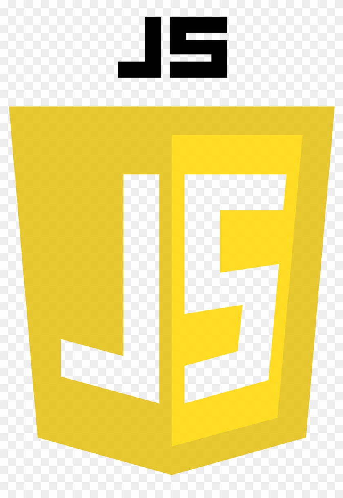

### About Me:
- <strong>Hi, I’m @nikhil-RGB!</strong>
- I have learned a bit of desktop application development in <strong>JAVA(AWT/SWING/JAVAFX)</strong>☕ and am trying out cross platform app development with <strong>Flutter and Dart</strong>!📲  
- I've also created a <strong>"Sekiro:Shadows Die Twice"</strong> mod, and update it from time to time!🎮 
- How to reach me: My email- javakingxi@gmail.com✉️ 
- Sometimes, I write stories and poems, check out all of my non-technical work from my [linktree](https://linktr.ee/nikhil_n67) 
- You can check out brief descriptions of all my work [here](https://nikhil-rgb.github.io) 
- <strong>PS: All icons in this README are links which describe the icon, if you want to know anything about what technology/association  an icon represents, click   on it for more information!</strong>

### Communities/Clubs/Organizations: 
   
  <i>Technical member at GeeksForGeeksCommunity(SRM-KTR)</i> 
   
   
   <i>Member at SRM NextTechLabs(KTR)</i>
 
    
    
   <i>Technical Member at Game Development Community SRM</i>
 
 
  
   
  

   

<h1 align="center">Hi! I'm Nikhil Narayanan!
  

 

</h1>

  
 

 

 

<h3 align="left">Connect with me:</h3>

  
  
    
  

<h3 align="left">Languages and Tools:</h3>
<h5 align="left">Programming Languages</h5>
    
  
  
  

  
  <h5 align="left">Markup/Stylesheet Languages</h5>
  
   
  
  
  
  
  
  <h5 align="left">Tools</h5>
   
  
  
  
  
  
  
   
    
   
    
    
   
 

<h2 align="center">Nikhil's Overview</h2>

|💻Most Used Languages and Stats 📈|🎯 Github Streaks and Trophies 🏆|
|-----------------------------------|----------------------------------|
||
||
 
<h1 >Total Profile Visits:</h1> 

